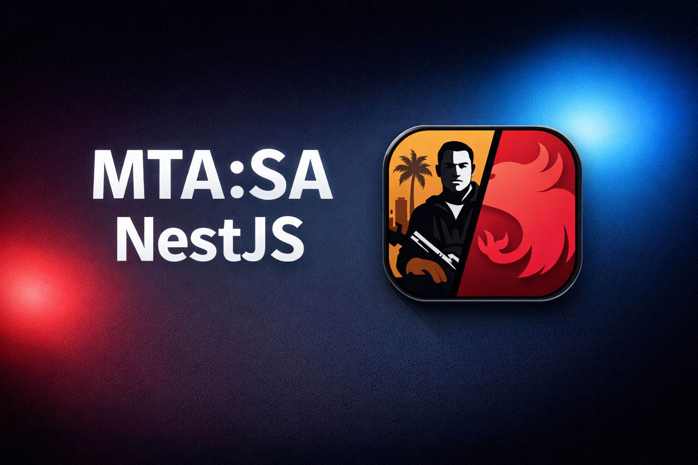

<h1>mtasa-nestjs</h1>

> A high-level API server framework for **MTA:SA**, inspired by **Express.js** and **NestJS**.

`mtasa-nestjs` brings structured, modular, and scalable backend architecture to Multi Theft Auto: San Andreas servers using pure Lua.  
It provides a clean request lifecycle, dependency-style organization, middleware pipelines, guards, interceptors, DTOs, and built-in JWT authentication.

---

## 🚀 Features

- ✅ High-level HTTP framework for MTA:SA
- ✅ Express.js-inspired routing
- ✅ NestJS-style architecture
- ✅ Controllers & Endpoints
- ✅ Middleware pipeline
- ✅ Guards (JWT / Authorization)
- ✅ Interceptors (response transformation)
- ✅ DTO support
- ✅ Structured exception handling
- ✅ Built-in JWT (HS256) implementation
- ✅ Password hashing utilities
- ✅ Zero external dependencies
- ✅ Fully modular & extensible

---

## 🏗 Architecture Overview

The request lifecycle follows a predictable and extensible flow:

```
Incoming Request
        ↓
   Middleware
        ↓
      Guard
        ↓
   Controller
        ↓
   Interceptor
        ↓
  JSON Response
```

This structure enables scalable and maintainable API development inside MTA resources.

---

## 📁 Project Structure

```
src/
│   meta.xml
│   Server.lua
│
├── controllers/
│   ├── auth.lua
│   ├── info.lua
│   └── user.lua
│
├── core/
│   ├── Base.lua
│   ├── Controller.lua
│   ├── DTO.lua
│   ├── Endpoint.lua
│   ├── Exception.lua
│   ├── Guard.lua
│   ├── Interceptor.lua
│   ├── JWT.lua
│   ├── Middleware.lua
│   └── Server.lua
│
├── dto/
│   └── auth.lua
│
├── guards/
│   └── auth.lua
│
├── interceptors/
│   └── response.lua
│
└── middlewares/
    ├── cors.lua
    └── json.lua
```

---

## 🔐 JWT Authentication

JWT support is built-in and implemented in:

```
src/core/JWT.lua
```

Supports:

- HS256 signing
- Token verification
- Expiration (\`exp\`)
- Custom payloads

### 🔑 Generate Token

```
local token = jwt.encode({
    userId = 123,
    role = "admin",
    exp = os.time() + 3600
}, "SECRET_KEY")
```

### 🛡 Protect Endpoint with Guard

Example guard:

```
AuthGuard = function(ctx)

    local authHeader = ctx.headers["authorization"]
    if not authHeader then
        error(Exception.Unauthorized("Missing Authorization header"))
    end

    local token = authHeader:match("^Bearer%s+(.+)$")
    if not token then
        error(Exception.Unauthorized("Invalid Authorization format"))
    end

    local payload = jwt.verify(token, "SECRET_KEY")
    if not payload then
        error(Exception.Unauthorized("Invalid or expired token"))
    end

    ctx.user = payload
    return true
end
```

Client must send:

```
Authorization: Bearer <jwt_token>
```

---

## 🧠 Middleware

Located in:

```
src/middlewares/
```

Middleware runs before controllers and can:

- Modify \`ctx\`
- Parse request body
- Handle CORS
- Reject requests

Example:

```
function JsonMiddleware(ctx)
    ctx.body = fromJSON(ctx.rawBody)
end
```

---

## 🎯 Controllers

Located in:

```
src/controllers/
```

Controllers define API logic and endpoints.

Examples can be found inside teh controllers folder.

---

## 📦 DTO (Data Transfer Objects)

Located in:

```
src/dto/
```

DTOs define and validate expected request payload structures.

This encourages predictable input handling and cleaner controller logic.

---

## 🛡 Guards

Located in:

```
src/guards/
```

Guards are used for:

- Authentication
- Authorization
- Role-based access control
- Blocking unauthorized requests

---

## 🎭 Interceptors

Located in:

```
src/interceptors/
```

Interceptors modify outgoing responses.

Use cases:

- Wrapping responses
- Adding metadata
- Formatting output
- Logging

---

## ⚠ Exception Handling

Located in:

```
src/core/Exception.lua
```

Throw structured HTTP errors:

```
return Exception.BadRequest("Invalid input")
or
error(Exception.Unauthorized("Unauthorized"))
```

The framework automatically handles:

- HTTP status codes
- JSON error formatting
- Clean error responses

---

## ▶ Installation

### 1️⃣ Place Resource

Move the project folder into:

```
mta-server/resources/
```

### 2️⃣ Register Resource

Add to \`mtaserver.conf\`:

```
<resource src="mtasa-nestjs" startup="1" protected="0" />
```

### 3️⃣ Start Server

```
start mtasa-nestjs
```

---

## 🎯 Design Philosophy

`mtasa-nestjs` aims to:

- Bring modern backend structure to MTA
- Encourage scalable architecture
- Improve API maintainability
- Separate concerns clearly
- Make Lua backend development structured and enjoyable

Note: in this repository, the folder is called "src" that would be placed in the "resources" folder, and for that reason the base url of your http server would be: `http(s)://<SERVER_IP>:22005/src/` So you can change that by changing the folder name (which is the name of the resource)

---

## 📈 Ideal Use Cases

- Game APIs
- Account systems
- Admin panels
- Web dashboards
- Authentication services
- Microservices inside MTA

---

## 🔧 Requirements

- Multi Theft Auto: San Andreas (MTA:SA)
- Lua (MTA runtime)

No external Lua libraries required.
All imported resources inside meta.xml files are for an examples (which they are being used inside the controllers)

---

## 📜 License

This project is licensed under the terms defined in the \`LICENSE\` file.

---

## 💡 Inspiration

- Express.js
- NestJS
- Modern REST API architecture

---

## ✨ Author

Built for structured and scalable backend development in MTA:SA.

---

If you like this project, consider ⭐ starring the repository.
